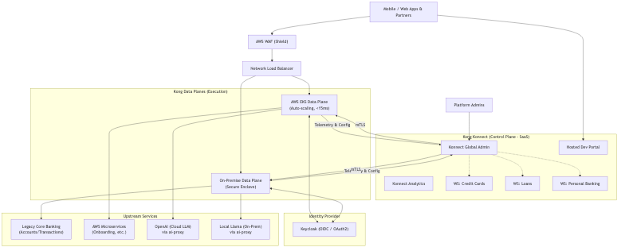
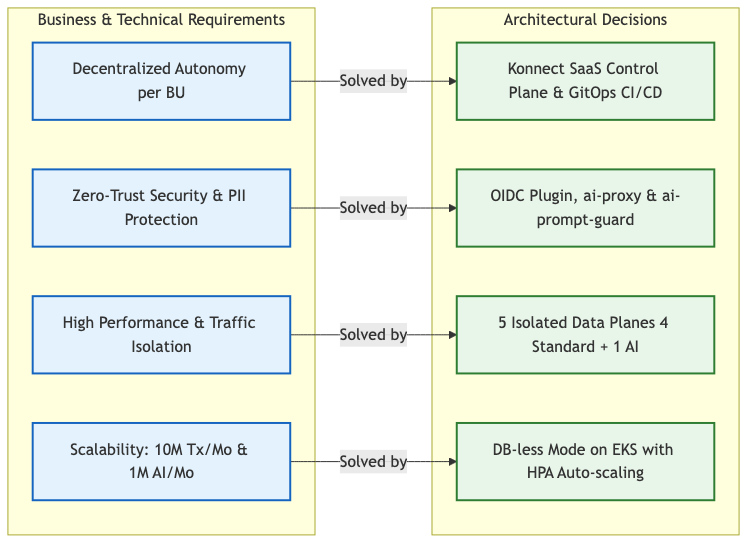

# Kong Service Delivery Blueprint
### Global Fintech Company
**Ricardo Zengin - Solutions Architect** **Perceptiva (Kong Partner)**  
*September 17, 2026*

## Table of Contents

  - [Global Fintech Company](#global-fintech-company)
- [1. Introduction](#1-introduction)
- [2. Business Alignment & Objectives](#2-business-alignment-&-objectives)
  - [Current Landscape](#current-landscape)
  - [Desired Future State](#desired-future-state)
  - [Key Success Criteria](#key-success-criteria)
- [3. Delivery Roadmap (12-Week Plan)](#3-delivery-roadmap-(12-week-plan))
- [4. Principles](#4-principles)
- [5. Technology Landscape and Solution Overview](#5-technology-landscape-and-solution-overview)
  - [Architecture Diagram](#architecture-diagram)
  - [Mapping of Architecture to Business Requirements](#mapping-of-architecture-to-business-requirements)
- [6. Certificates, Keys and Secrets](#6-certificates-keys-and-secrets)
- [7. API Security and Access](#7-api-security-and-access)
- [8. Observability](#8-observability)
- [9. Platform Ops & API Ops](#9-platform-ops-&-api-ops)
- [10. Developer Experience](#10-developer-experience)
- [11. High Availability and Sizing](#11-high-availability-and-sizing)
- [12. Kong Launch Playbook Alignment](#12-kong-launch-playbook-alignment)
- [Initial Kickoff Meeting Minutes](#initial-kickoff-meeting-minutes)
  - [1. Current Client Context](#1-current-client-context)
  - [2. Pain Points](#2-pain-points)
  - [3. Migration Objectives (Towards Kong / Kong AI)](#3-migration-objectives-(towards-kong--kong-ai))
  - [4. Next Steps (Action Items)](#4-next-steps-(action-items))
- [Discovery Questionnaire - Fintech Global Banco](#discovery-questionnaire---fintech-global-banco)
  - [1. Identity & Security (OAuth / OIDC)](#1-identity-&-security-(oauth--oidc))
  - [2. Traffic Management & Rate Limiting](#2-traffic-management-&-rate-limiting)
  - [3. High Availability (HA) & Architecture](#3-high-availability-(ha)-&-architecture)
  - [4. AI Gateway & Fraud Analysis](#4-ai-gateway-&-fraud-analysis)
  - [5. APIOps & CI/CD](#5-apiops-&-cicd)
  - [6. Observability](#6-observability)
  - [7. Developer Portal](#7-developer-portal)
- [High-Level Architecture Proposal: Multi-BU Workspace Structure](#high-level-architecture-proposal-multi-bu-workspace-structure)
  - [1. Control Plane (Kong Konnect)](#1-control-plane-(kong-konnect))
  - [2. Data Plane (Execution Layer)](#2-data-plane-(execution-layer))
  - [3. Developer Portal](#3-developer-portal)
- [Inventory of Critical APIs (Top 10) - PoC Candidates](#inventory-of-critical-apis-(top-10)---poc-candidates)
  - [Core Banking APIs (High Traffic / Legacy Integration)](#core-banking-apis-(high-traffic--legacy-integration))
  - [Business Unit Specific APIs](#business-unit-specific-apis)
  - [Open Banking / Partner APIs](#open-banking--partner-apis)
  - [AI Use Cases (Kong AI Gateway Candidates)](#ai-use-cases-(kong-ai-gateway-candidates))
- [Kong AI Gateway: Key Capabilities for Banking Security](#kong-ai-gateway-key-capabilities-for-banking-security)
  - [1. Centralized AI Abstraction & Governance (`ai-proxy`)](#1-centralized-ai-abstraction-&-governance-(`ai-proxy`))
  - [2. Data Exfiltration Prevention (`ai-prompt-guard` / `ai-prompt-decorator`)](#2-data-exfiltration-prevention-(`ai-prompt-guard`--`ai-prompt-decorator`))
  - [3. Token-Based Rate Limiting and Cost Control](#3-token-based-rate-limiting-and-cost-control)
  - [4. Analytics and Audit Trails](#4-analytics-and-audit-trails)

# Kong Blueprint - Global Fintech Company

*Based on the Kong MASTER CX Blueprint.*

## 1. Introduction
The purpose of this document is to provide a high-level solution blueprint for implementing the Kong Konnect platform for the Global Fintech Company. It summarizes the technical decisions and plans for the initial delivery of the Kong platform.

## 2. Business Alignment & Objectives
### Current Landscape
- Highly siloed operations between Credit Cards, Loans, and Personal Banking units.
- Legacy core systems causing bottlenecks and high latency.
- Security concerns regarding data exfiltration when using public LLMs for AI initiatives.

### Desired Future State
- Decentralized autonomy (each BU manages its own APIs via GitOps).
- High performance and isolation of transactional vs. AI traffic.
- Zero-trust security for partners and strict PII redaction for AI endpoints.

### Key Success Criteria
- Reduce time to market for Fintech partners.
- Ensure zero exposure of internal LLMs to public internet.
- Provide a scalable, highly available API platform.

## 3. Delivery Roadmap (12-Week Plan)
*Roadmap for delivering a production-ready platform (Gantt Chart representation):*

| Phase / Activity | Weeks 1-3 | Weeks 4-6 | Weeks 7-9 | Weeks 10-12 |
| :--- | :---: | :---: | :---: | :---: |
| **Discovery & Foundation** (Konnect, SSO, EKS) | 🟩 | | | |
| **MVP Implementation** (Data Planes, OIDC, AI Proxy) | | 🟩 | | |
| **APIOps & CI/CD** (GitOps, `decK`, Dev Portal) | | | 🟩 | |
| **Go-Live & Shakedown** (Migration, Testing, Rollout) | | | | 🟩 |

## 4. Principles
- **Architecture principles:** Microservices architecture, elastic scaling, fault tolerance.
- **Security principles:** Encrypt at rest and in transit, zero-trust for external consumers, protect LLM access.

## 5. Technology Landscape and Solution Overview

### Architecture Diagram

### Mapping of Architecture to Business Requirements

- **Logical Architecture:** Kong Konnect (CP) managing 5 Kubernetes-based Data Planes (DP), including a dedicated one for AI Gateway 2.0.
- **Infrastructure:** AWS EKS for Data Planes. LoadBalancer for ingress.
- **Platform Security:** 
  - Control Plane access via Konnect SSO / RBAC.
  - Data Planes secured behind AWS Advanced Shield (WAF).
- **Data Plane Clusters:** Dedicated cluster for External Fintech APIs and AI Processing.

## 6. Certificates, Keys and Secrets
- **Secrets Manager:** AWS Secrets Manager or Kubernetes Secrets.
- **Certificate Management:** Let's Encrypt / AWS Certificate Manager for mTLS.

## 7. API Security and Access
- **Client Authentication:** OIDC (via Keycloak/Kong Identity) for 3rd-party Fintech partners.
- **Rate Limiting:** Advanced Rate Limiting to enforce tiered access.
- **AI Security:** `ai-proxy` (configured with `route_type: "llm/v1/chat"`) to broker requests to fraud analysis LLM, and `ai-prompt-guard` to prevent data exfiltration.

## 8. Observability
- **Log Aggregation:** ElasticSearch / Splunk.
- **Metrics:** Prometheus and Grafana for Data Plane metrics.
- **Tracing:** Jaeger / OpenTelemetry (Post-MVP).

## 9. Platform Ops & API Ops
- **Repositories:** GitHub for Declarative Configs (OAS + Kong Plugins).
- **Deployment Process:** GitHub Actions triggering `deck file openapi2kong` and `deck sync`.
- **Approval Process:** Pull Requests required for any API/Plugin modifications.

## 10. Developer Experience
- **API Catalogue:** Konnect Hosted Developer Portal.
- **Onboarding:** Automated application registration for approved Fintech partners.

## 11. High Availability and Sizing
- **Data Plane:** Minimum 3 replicas, auto-scaling based on CPU/Memory usage. Kong Gateway v3.15.0.6 for standard APIs, and `kong/kong-ai-gateway:2.0.3` for the AI data plane.
- **Sizing:** Instances sized to handle peak transactions/sec across Accounts and Payments APIs, and isolated instances for AI token processing.

## 12. Kong Launch Playbook Alignment
This Blueprint has been designed adhering to the 6 core pillars of the Kong Launch Playbook MVP architecture:

- **Resilient:** 5 distinct Data Planes (4 standard, 1 AI) ensure complete traffic isolation. A peak in LLM usage will not affect core banking transactions.
- **Reliable:** By utilizing DB-less mode connected to Konnect (SaaS), the architecture is built to fail with grace. Data Planes will continue serving traffic even if connectivity to the Control Plane is temporarily lost.
- **Observable:** Telemetry endpoints are fully configured for Prometheus/Grafana (engineering visibility) and Konnect Vitals (business mission intelligence and chargeback).
- **Well Architected:** This formal CX Blueprint document ensures a solid foundation for future innovation and acts as the official sign-off with stakeholders.
- **Adheres to best practices:** 100% adoption of APIOps (GitOps repo with `decK`) and Infrastructure as Code (`docker-compose`/Terraform), completely eliminating manual UI configuration for APIs.
- **Focuses on a small scope initial API:** The MVP scopes specifically the critical Accounts, Payments, Transactions, and AI Fraud endpoints, guaranteeing rapid business benefit realization.

# Appendices

## Initial Kickoff Meeting Minutes

- **Date:** September 16, 2026
- **Client:** Fintech Global Banco
- **Attendees:** 
  - Roberto Navarro (Architecture Director, Fintech Global Banco)
  - Ricardo Zengin (Solutions Architect, Perceptiva)

***

### 1. Current Client Context
At Fintech Global Banco, we currently have a growing microservices architecture, but our current (legacy) API Gateway has become a bottleneck. We have multiple Business Units (BUs) such as Credit Cards, Loans, and Personal Banking, and each needs to manage its own APIs with some autonomy, but under centralized governance.

### 2. Pain Points
- **Lack of Autonomy:** Development teams in each business unit rely on a central team to publish or modify API policies.
- **Performance:** High latency during peak hours.
- **Visibility:** We lack a unified dashboard that allows us to view real-time traffic and errors across all BUs in a segmented way.
- **AI Adoption:** We want to start integrating Artificial Intelligence models (LLMs) into our API flows securely, and we don't know how our current gateway can support this.
- **Developer Friction:** External partners complain about the slow onboarding process. Frontend teams are blocked when backend systems are down.
- **Traffic Overload & Risk:** Legacy systems are overwhelmed by read traffic, and we have no way to do gradual (Canary) rollouts without risking downtime.

### 3. Migration Objectives (Towards Kong / Kong AI)
- Implement a **multi-BU configuration (Control Planes)** where each unit has its isolated environment, but with corporate security policies (authentication, rate limiting) applied globally.
- Improve performance and reduce latency by utilizing Kong's `proxy-cache-advanced`.
- Establish a **private Developer Portal** for secure partner onboarding and API catalogue management.
- Enable **Canary deployments** and **API Mocking** to accelerate delivery and reduce deployment risks.
- Understand the **advantages of migrating to Kong AI Gateway 2.0** to route traffic to different AI providers, manage usage (tokens), and apply security policies on prompts and responses, using a dedicated AI Data Plane to avoid port conflicts and ensure high performance.

### 4. Next Steps (Action Items)
1. **[Ricardo Zengin - Perceptiva]** Prepare a high-level architecture proposal showing how the Business Units (Workspaces) would be structured in Kong.
2. **[Ricardo Zengin - Perceptiva]** Send a summary of Kong AI Gateway's key capabilities focused on banking security.
3. **[Roberto Navarro]** Share the current inventory of critical APIs (Top 10) that would be candidates for the Proof of Concept (PoC).
4. Schedule a technical deep dive session for next week.

***
*Additional Notes:*
*Roberto emphasized that security and data segregation between BUs is the number one (non-negotiable) requirement to move forward.*

## Discovery Questionnaire - Fintech Global Banco

**Date:** September 16, 2026
**Client:** Fintech Global Banco (Roberto Navarro - CTO)

Below are the answers to the discovery questions to better understand our architecture and technical needs:

### 1. Identity & Security (OAuth / OIDC)
- **Which Identity Provider (IdP) is the company currently using for their internal systems and third-party partners?**
  We comply with PCI-DSS and GDPR. We require strict authentication (OIDC/OAuth2) for all services.
- **Do we need to integrate with an existing Keycloak instance, or should we set up a new Kong Identity / Keycloak environment for this MVP?**
  For the PoC/MVP, we will set up a new Keycloak instance to act as our Identity Provider for OIDC flows.
- **Are there different authentication flows required for Mobile Apps vs. 3rd-party Fintech partners?**
  Yes, 3rd-party Fintech partners will need to register and use OIDC Client Credentials flow to access our APIs.

### 2. Traffic Management & Rate Limiting
- **What are the expected traffic volumes for the Accounts, Payments, and Transactions APIs?**
  We currently process around 10 million API calls per month across our 3 core APIs. For the new AI Fraud Analysis use cases, we estimate about 1 million monthly AI calls.
- **Do we need tiered rate limiting (e.g., Bronze, Silver, Gold) for different consumers (Internal Analytics vs. 3rd-party partners)?**
  Yes, we need to enforce strict Rate Limiting per consumer to prevent abuse. Also, our Accounts backend struggles with high read volume, so we need proxy-caching for at least 60 seconds.
- **Are there any specific SLAs we need to enforce per consumer?**
  Our target is < 15ms overhead for standard API routing through the Gateway.

### 3. High Availability (HA) & Architecture
- **What are the High Availability requirements for the Data Plane?**
  We need the Gateway to comfortably handle the 10M+ volume and scale horizontally (up to 5 Gateway Services initially).
- **Will the deployment be multi-region, or single-region with multiple availability zones?**
  We have a hybrid environment. Core Banking remains on-premise, while new digital channels and microservices are hosted on AWS (EKS). We need 5 isolated Data Planes across these environments.
- **Are there specific latency requirements we need to consider?**
  Yes, < 15ms latency overhead as mentioned, plus zero-downtime (Canary) deployments routing e.g., 10% of traffic to v2 before full cutover.

### 4. AI Gateway & Fraud Analysis
- **Which LLM provider (e.g., OpenAI, AWS Bedrock, Cohere) is being used for the AI-powered fraud analysis?**
  We are building a customer service chatbot powered by OpenAI, and an internal credit risk analysis tool using a locally hosted Llama model. We need to abstract the provider so we can switch easily.
- **What are the specific compliance and logging requirements for AI usage (e.g., redacting PII, logging prompts/responses)?**
  Data exfiltration is our biggest fear. We need a central gateway that intercepts all LLM calls and blocks any attempt to send credit card numbers (PII) in prompts.
- **Do we need to enforce token-based rate limiting or cost control for the LLM calls?**
  Yes, we need to track how many tokens each Business Unit consumes to charge them internally (chargeback).

### 5. APIOps & CI/CD
- **What CI/CD tools (e.g., GitHub Actions, GitLab CI) are currently used by the development teams?**
  We use GitHub Actions to automate our pipelines.
- **Where are the OpenAPI Specifications (OAS) currently stored, and how are they versioned?**
  They are stored in Git repositories. We want each of our 3 BUs (Credit Cards, Loans, Personal Banking) to have its own Workspace and self-manage their routes/plugins via APIOps (declarative config) without relying on a central Infrastructure team.

### 6. Observability
- **Do you have an existing Prometheus/Grafana stack, or do you expect Kong Konnect to provide the primary dashboarding capabilities?**
  We expect Konnect to provide a unified dashboard (Vitals) that allows us to view real-time traffic and errors across all BUs in a segmented way, alongside exporting metrics to our own tools.
- **What specific metrics (e.g., latency, error rates, AI token usage) are critical for the business stakeholders?**
  Error rates, latency per BU, and precise AI token usage per provider/BU.

### 7. Developer Portal
- **What is the onboarding process for 3rd-party fintech partners? Do they require manual approval before accessing the APIs?**
  We need a private Developer Portal where external Fintechs can view our API catalogue and securely register their apps (OIDC) without manual intervention from our side.
- **Are there specific branding requirements for the private Developer Portal?**
  Yes, it needs to reflect Fintech Global Banco's corporate branding.

## High-Level Architecture Proposal: Multi-BU Workspace Structure

- **To:** Roberto Navarro, CTO - Fintech Global Banco
- **From:** Ricardo Zengin (Perceptiva)
- **Date:** September 16, 2026

Based on our kickoff meeting and discovery session, here is the proposed high-level architecture using Kong Konnect to support your multi-BU structure while maintaining centralized governance.

### 1. Control Plane (Kong Konnect)
The Control Plane will be hosted on Kong Konnect (SaaS). This provides a single pane of glass for all BUs without the operational overhead of managing the database (PostgreSQL) or control plane nodes.

#### Workspace Structure
To guarantee autonomy and isolation, we will implement the following Workspace topology:

- **Global Workspace (Admin/Platform Team):** 
  - Manages global entities such as the Identity Provider (Keycloak/OIDC) configuration, global security plugins (e.g., WAF, global rate limits), and underlying infrastructure connections.
- **BU1 Workspace: Credit Cards:**
  - Dedicated environment for the Credit Cards team to manage their routes, services, and local rate-limiting policies.
- **BU2 Workspace: Loans:**
  - Dedicated environment for the Loans team to manage origination and scoring APIs.
- **BU3 Workspace: Personal Banking:**
  - Dedicated environment for the core banking integration APIs.

*Security Note: Role-Based Access Control (RBAC) will strictly prevent the Credit Cards team from modifying or even viewing the configurations in the Loans Workspace.*

### 2. Data Plane (Execution Layer)
Since you operate in a hybrid cloud, Kong's Data Planes (DPs) will be deployed where the workloads reside. The DPs pull configurations securely from Konnect via mTLS.

- **AWS EKS Clusters (Cloud):** 5 isolated Data Planes running natively on Kubernetes. Each BU (Credit Cards, Loans, Personal Banking, Core) gets its own DP to prevent port conflicts and noisy-neighbor issues. Crucially, a 5th **Dedicated AI Gateway Data Plane** is deployed to isolate high-latency token generation workloads from standard transactional APIs. These nodes will scale horizontally based on traffic.
- **On-Premise Data Centers:** Dedicated Data Plane nodes placed in front of your legacy Core Banking systems. These nodes ensure that sensitive core traffic doesn't need to trombone through the public cloud just for API Gateway enforcement.

### 3. Developer Portal
A unified Developer Portal will be exposed through Konnect, but API visibility will be segmented. Third-party Fintech partners will only see the APIs they are authorized to consume (e.g., Open Banking APIs).

## Inventory of Critical APIs (Top 10) - PoC Candidates

- **From:** Roberto Navarro, CTO - Fintech Global Banco
- **Date:** September 16, 2026

Team, as agreed in our kickoff meeting, here is the list of our Top 10 critical APIs. These are the primary candidates we want to migrate and test during the Proof of Concept (PoC) using Kong and Kong AI Gateway.

### Core Banking APIs (High Traffic / Legacy Integration)
1. **Accounts API (`/v1/accounts`)**
   - **Type:** REST (Read-heavy)
   - **Traffic:** ~4M calls/month
   - **Notes:** Needs aggressive caching and strict OIDC authentication.

2. **Transactions API (`/v1/transactions`)**
   - **Type:** REST
   - **Traffic:** ~3M calls/month
   - **Notes:** High latency currently; we need Kong to improve routing performance.

3. **Payments API (`/v1/payments`)**
   - **Type:** REST (Write-heavy)
   - **Traffic:** ~3M calls/month
   - **Notes:** Mission-critical. Requires highest HA and strict rate limiting to prevent abuse.

### Business Unit Specific APIs
4. **Card Issuance API (`/v1/cards/issue`)**
   - **BU:** Credit Cards
   - **Notes:** Strict PCI-DSS compliance required. Needs data masking in logs.

5. **Loan Origination API (`/v1/loans/apply`)**
   - **BU:** Loans
   - **Notes:** Integrates with third-party credit bureaus.

6. **Customer Onboarding API (`/v1/customers/onboard`)**
   - **BU:** Personal Banking
   - **Notes:** Mobile app consumes this directly. Needs edge protection (WAF integration).

### Open Banking / Partner APIs
7. **Open Banking Consent API (`/v1/consent`)**
   - **BU:** Platform
   - **Notes:** To be exposed via the Developer Portal for 3rd party Fintechs. Requires tiered rate limiting (Gold/Silver/Bronze partners).

8. **Partner Statement Generation API (`/v1/statements`)**
   - **Type:** GraphQL
   - **Notes:** Heavy payload.

### AI Use Cases (Kong AI Gateway Candidates)
9. **Customer Support Chatbot API (`/v1/ai/support-chat`)**
   - **Provider:** OpenAI (Cloud)
   - **Notes:** Must use `ai-proxy`. Needs prompt guarding to prevent users from sharing passwords or credit card info.

10. **Internal Fraud Analysis API (`/v1/ai/fraud-score`)**
    - **Provider:** Local Llama 3 Model (On-premise)
    - **Notes:** Highly sensitive data. Token-based rate limiting required to manage local GPU resources.

## Kong AI Gateway: Key Capabilities for Banking Security

**To:** Roberto Navarro, CTO - Fintech Global Banco
**From:** Ricardo Zengin (Perceptiva)
**Date:** September 16, 2026

As requested during our kickoff, here is a summary of how Kong AI Gateway addresses the specific security, compliance, and governance concerns you raised regarding the adoption of Large Language Models (LLMs) in a banking environment.

### 1. Centralized AI Abstraction & Governance (`ai-proxy`)
**The Challenge:** Hardcoding LLM credentials (like OpenAI keys) in every microservice creates a massive security risk and vendor lock-in.
**Kong's Solution:** With **AI Gateway 2.0**, the `ai-proxy` plugin (using standardized configurations like `route_type: "llm/v1/chat"`) abstracts the LLM provider. Your internal apps make a standard API call to Kong. Kong holds the API keys securely in its vault and brokers the request to OpenAI or your local Llama model via a dedicated, isolated Data Plane to guarantee performance.
*Benefit: You can switch from OpenAI to another provider instantly without changing a single line of application code.*

### 2. Data Exfiltration Prevention (`ai-prompt-guard` / `ai-prompt-decorator`)
**The Challenge:** Preventing users or internal systems from sending sensitive PII (like Credit Card numbers or account balances) to a public LLM.
**Kong's Solution:** 
- **Prompt Guard:** Can block requests that contain unauthorized patterns (using regex) or inappropriate content before it even leaves your network.
- **Prompt Decorator:** Can inject specific context or system prompts (e.g., "You are a secure banking assistant. Do not answer questions outside of banking.") to prevent prompt injection attacks.
*Benefit: Absolute control over what data is allowed to reach public AI models.*

### 3. Token-Based Rate Limiting and Cost Control
**The Challenge:** LLM usage can spiral out of control, leading to massive unexpected bills, and it's hard to know which BU is spending what.
**Kong's Solution:** Kong AI Gateway parses the token usage returned by the LLM providers. We can implement `ai-rate-limiting-advanced` to limit usage based on the *number of tokens*, not just the number of API calls.
*Benefit: You can assign a monthly token budget to the 'Credit Cards' BU and a different budget to the 'Loans' BU, enabling precise chargeback models and preventing billing surprises.*

### 4. Analytics and Audit Trails
**The Challenge:** Lack of visibility into how AI is being used.
**Kong's Solution:** Kong captures rich analytics on every AI request, including provider latency, token count, and model used, exporting this securely to your existing observability stack (Splunk/Datadog).

