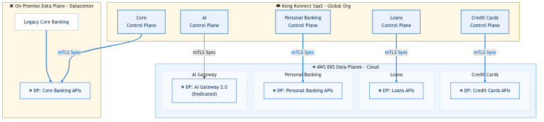

# Final Blueprint - Day 2: Architecture & Implementation Evolution
### Global Fintech Company
**Ricardo Zengin - Solutions Architect** **Perceptiva (Kong Partner)**  
*September 17, 2026*

## Table of Contents

  - [Global Fintech Company](#global-fintech-company)
- [1. Introduction](#1-introduction)
- [2. Business Alignment & Objectives](#2-business-alignment-&-objectives)
  - [Current Landscape](#current-landscape)
  - [Implemented State (Day 2)](#implemented-state-(day-2))
- [3. Delivery Roadmap (12-Week Plan)](#3-delivery-roadmap-(12-week-plan))
- [4. Principles](#4-principles)
- [5. Technology Landscape and Solution Overview](#5-technology-landscape-and-solution-overview)
  - [Architecture Diagram](#architecture-diagram)
  - [Logical and Physical Topology](#logical-and-physical-topology)
- [6. Certificates, Keys and Secrets](#6-certificates-keys-and-secrets)
- [7. API Security and Access](#7-api-security-and-access)
- [8. Observability](#8-observability)
- [9. Platform Ops & API Ops](#9-platform-ops-&-api-ops)
- [10. Developer Experience](#10-developer-experience)
- [11. High Availability and Sizing](#11-high-availability-and-sizing)
- [12. Kong Launch Playbook Alignment](#12-kong-launch-playbook-alignment)
  - [Evolution Summary](#evolution-summary)

## 1. Introduction
The purpose of this document is to detail the evolution of the Initial Blueprint (Day 1), moving from the architectural proposal to the **real technical implementation** of the solution using Kong Konnect, Kubernetes, APIOps, and Terraform.

## 2. Business Alignment & Objectives
### Current Landscape
- Highly siloed operations between Credit Cards, Loans, and Personal Banking units.
- Legacy core systems causing bottlenecks and high latency.
- Security concerns regarding data exfiltration when using public LLMs for AI initiatives.

### Implemented State (Day 2)
- **Decentralized autonomy:** Each BU manages its own APIs via GitOps using `decK`.
- **High performance:** Implemented caching strategies and isolated transactional vs. AI traffic at the Data Plane level.
- **Zero-trust security:** Centralized OIDC with Keycloak for partners, and strict PII redaction using `ai-prompt-guard` for AI endpoints.

## 3. Delivery Roadmap (12-Week Plan)
*Roadmap for delivering a production-ready platform (Gantt Chart representation):*

| Phase / Activity | Weeks 1-3 | Weeks 4-6 | Weeks 7-9 | Weeks 10-12 |
| :--- | :---: | :---: | :---: | :---: |
| **Discovery & Foundation** (Konnect, SSO, EKS) | 🟩 | | | |
| **MVP Implementation** (Data Planes, OIDC, AI Proxy) | | 🟩 | | |
| **APIOps & CI/CD** (GitOps, `decK`, Dev Portal) | | | 🟩 | |
| **Go-Live & Shakedown** (Migration, Testing, Rollout) | | | | 🟩 |

## 4. Principles
- **Architecture principles:** Microservices architecture, elastic scaling, fault tolerance.
- **Security principles:** Encrypt at rest and in transit, zero-trust for external consumers, protect LLM access.

## 5. Technology Landscape and Solution Overview

### Architecture Diagrams

#### Requirements Mapping

#### Control Plane & Data Plane Topology

### Logical and Physical Topology
- **Control Plane (Kong Konnect SaaS):** Multiple logical Control Planes configured for segmentation (`RZE-Core Banking`, `RZE-Credit Cards`, `RZE-Loans`, `RZE-Personal Banking`, `RZE-AI-Gateway-2.0`).
- **Data Plane (Execution Layer):** 
  - **AWS EKS Cloud Data Planes:** The APIs for Credit Cards, Loans, Personal Banking, and the dedicated AI Gateway 2.0 are deployed natively within a managed AWS EKS Kubernetes cluster.
  - **On-Premise Data Plane:** The Legacy Core Banking APIs are managed through an isolated Data Plane running on-premise in a traditional Datacenter, ensuring secure and direct access to legacy systems without exposing them directly to the cloud.

## 6. Certificates, Keys and Secrets
- **Certificates:** Each DP securely connects to its respective CP in Konnect using **mTLS** (anchored certificates locally generated by Terraform).
- **Secrets Management:** Kong centralizes AI provider credentials (e.g., `OPENAI_API_KEY`) securely via Konnect's AI Gateway configurations, preventing leaks to end clients.

## 7. API Security and Access
- **Client Authentication:** OIDC (via Keycloak) implemented for Machine-to-Machine (`client_credentials`) flows in the Core Banking CP.
- **Advanced Traffic Management:**
  - **Rate Limiting Advanced:** Deployed in Credit Cards to protect `/transactions`.
  - **Web Application Firewall (WAF):** Simulated via `ip-restriction` in Personal Banking.
  - **Data Masking:** `request-transformer` implemented for obfuscating PCI-DSS sensitive data.
- **AI Security:** `ai-prompt-guard` acts as a cognitive firewall blocking PII and injection attempts on the fly.

## 8. Observability
- **Native Telemetry:** The global `opentelemetry` plugin was activated declaratively.
- **Backend:** Traces and metrics are exported directly to **Signoz**, allowing unified correlation of logs, metrics, and security blocks across all Data Planes in real-time.

## 9. Platform Ops & API Ops
- **GitOps Monorepo:** Configurations reside in `gitops-monorepo/kong-config/` organized by BU.
- **Tooling:** `decK` (Declarative Configuration for Kong) is used to synchronize states (`deck gateway diff/sync`).
- **Infrastructure Automation:** Terraform is used to provision Control Planes and the Developer Portal automatically (`main.tf`, `portal.tf`).

## 10. Developer Experience
- **Developer Portal:** A unified Developer Portal (`RZE-FinTech-Portal`) was provisioned via Terraform.
- **API Catalog Strategy:** 10 APIs were uploaded to the internal Next-Gen Catalog, but only authorized external APIs (e.g., Accounts, Transactions, Open Banking Consent) were exposed on the external portal for Fintech onboarding.
- **Mock Services:** Local `httpbin` upstreams allow developers to test auth and rate-limiting policies predictably without hitting legacy backends.

## 11. High Availability and Sizing
- **Data Plane Isolation:** Transactional traffic and AI token processing are completely physically and logically separated to guarantee zero interference during traffic spikes.
- **Canary Releases:** Upstreams were configured with multiple targets and weight-based routing to allow safe and progressive API deployments.

## 12. Kong Launch Playbook Alignment
This Blueprint has been implemented adhering to the 6 core pillars of the Kong Launch Playbook MVP architecture:

- **Resilient:** 5 distinct Control Planes and isolated Data Planes ensure complete traffic isolation.
- **Reliable:** DB-less mode ensures Data Planes continue serving traffic even if connectivity to Konnect is lost.
- **Observable:** Telemetry endpoints are fully configured and exported to Signoz.
- **Well Architected:** Built on IaC (Terraform) and Declarative Configs (decK).
- **Adheres to best practices:** 100% adoption of APIOps, completely eliminating manual UI configuration for APIs.
- **Focuses on a small scope initial API:** The MVP successfully scoped Accounts, Transactions, and AI Fraud endpoints.

---

### Evolution Summary
We transitioned from a static architectural design (Day 1) to a **living platform**, highly automated via GitOps/APIOps and Infrastructure as Code, where security, traffic management, and the consumption of Artificial Intelligence models are centralized, but API governance is distributed and managed autonomously by each BU.
